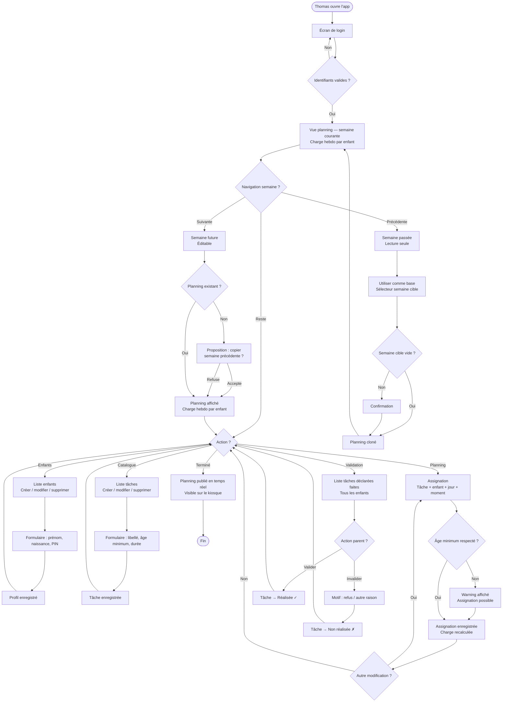
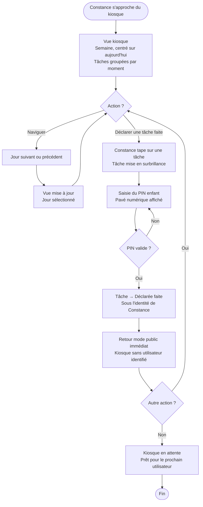
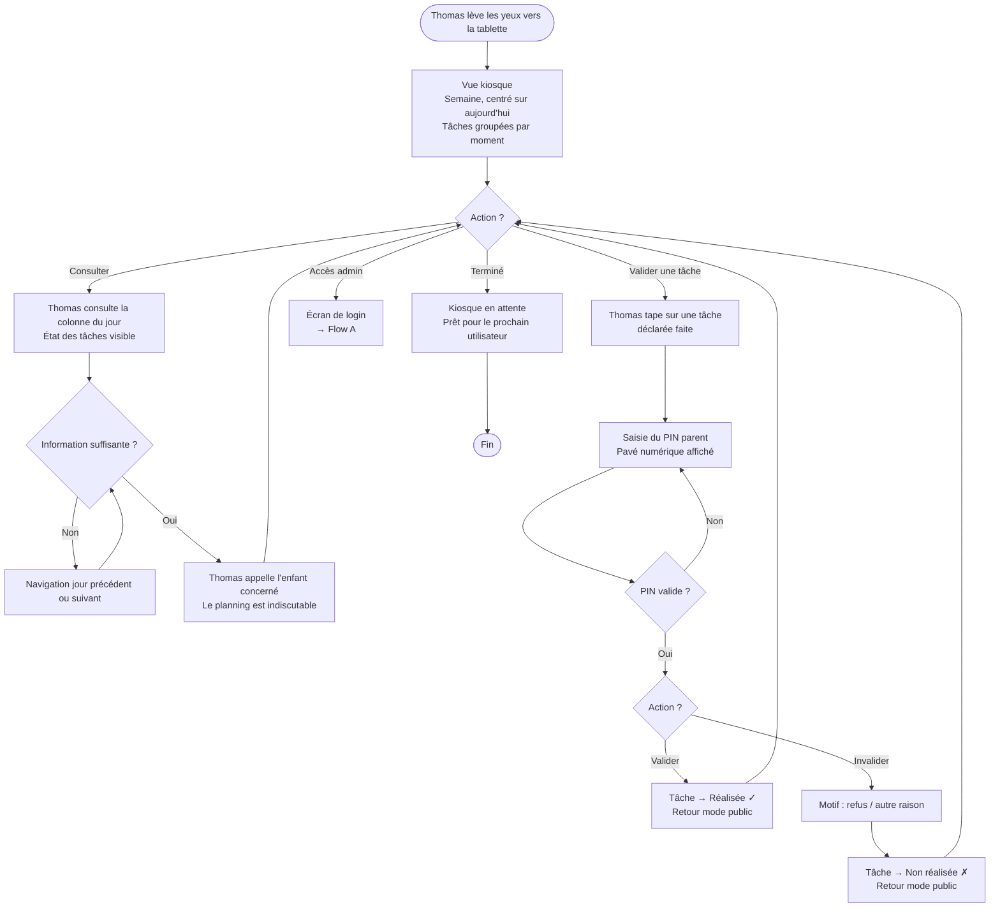
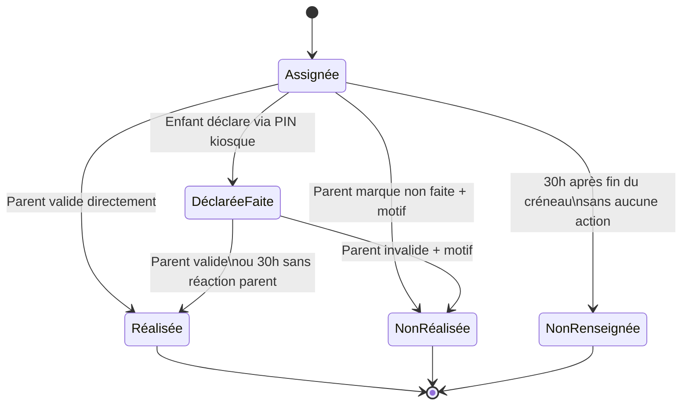

# User flows — Family Control Panel App
_Version 0.2 — mai 2025 — Cycle 1 MVP_

---

## Flow A — Le parent configure le planning

---

## Flow B — Constance consulte et coche ses tâches

---

## Flow C — Thomas consulte et valide depuis le kiosque

---

## Machine à états — Assignation de tâche

